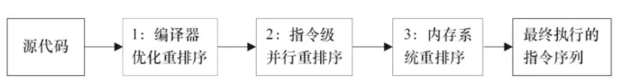

# 认识重排序与happens-before

**什么是重排序？**

在不改变程序执行结果的前提下，尽可能提高并行度。JMM对底层尽量减少约束，使其能够发挥自身优势。因此，在执行程序时，**为了提高性能，编译器和处理器常常会对指令进行重排序**。一般重排序可以分为如下三种：



* **编译器优化重排**

  编译器在**不改变单线程程序语义**的前提下，可以重新安排语句的执行顺序。

* **指令并行重排**

  现代处理器采用了指令级并行技术来将多条指令重叠执行。如果**不存在数据依赖性**\(即后一个执行的语句无需依赖前面执行的语句的结果\)，处理器可以改变语句对应的机器指令的执行顺序。

* **内存系统重排**

  由于处理器使用缓存和读写缓存冲区，这使得加载\(load\)和存储\(store\)操作看上去可能是在乱序执行，因为三级缓存的存在，导致内存与缓存的数据同步存在时间差。

**指令重排可以保证串行语义一致，但是没有义务保证多线程间的语义也一致**。所以在多线程下，指令重排序可能会导致一些问题，比如乱序问题，但是这点牺牲是值得的。

**什么是as-if-serial**

as-if-serial语义的意思是：不管怎么重排序（编译器和处理器为了提供并行度），（单线程）程序的执行结果不能被改变。编译器，runtime和处理器都必须遵守as-if-serial语义。as-if-serial语义把单线程程序保护了起来，**遵守as-if-serial语义的编译器，runtime和处理器共同为编写单线程程序的程序员创建了一个幻觉：单线程程序是按程序的顺序来执行的**。  


**顺序一致性模型与JMM的保证**

顺序一致性模型是一个**理论参考模型**，内存模型在设计的时候都会以顺序一致性内存模型作为参考。

**数据竞争与顺序一致性**

当程序未正确同步的时候，就可能存在数据竞争。

> 数据竞争：在一个线程中写一个变量，在另一个线程读同一个变量，并且写和读没有通过同步来排序。

如果程序中包含了数据竞争，那么运行的结果往往充满了**不确定性**，比如读发生在了写之前，可能就会读到错误的值；如果一个线程程序能够正确同步，那么就不存在数据竞争。

Java内存模型（JMM）对于正确同步多线程程序的内存一致性做了以下保证：

> **如果程序是正确同步的，程序的执行将具有顺序一致性**。 即程序的执行结果和该程序在顺序一致性模型中执行的结果相同。

这里的同步包括了使用`volatile`、`final`、`synchronized`等关键字来实现**多线程下的同步**。

如果程序员没有正确使用`volatile`、`final`、`synchronized`，那么即便是使用了同步（单线程下的同步），JMM也不会有内存可见性的保证，可能会导致你的程序出错，并且具有不可重现性，很难排查。

所以如何正确使用`volatile`、`final`、`synchronized`，是程序员应该去了解的。后面会有专门的章节介绍这几个关键字的内存语义及使用。

#### 顺序一致性模型 <a id="722-&#x987A;&#x5E8F;&#x4E00;&#x81F4;&#x6027;&#x6A21;&#x578B;"></a>

顺序一致性内存模型是一个**理想化的理论参考模型**，它为程序员提供了极强的内存可见性保证。

顺序一致性模型有两大特性：

* 一个线程中的所有操作必须按照程序的顺序（即Java代码的顺序）来执行。
* 不管程序是否同步，所有线程都只能看到一个单一的操作执行顺序。即在顺序一致性模型中，每个操作必须是**原子性的，且立刻对所有线程可见**。

为了理解这两个特性，我们举个例子，假设有两个线程A和B并发执行，线程A有3个操作，他们在程序中的顺序是A1-&gt;A2-&gt;A3，线程B也有3个操作，B1-&gt;B2-&gt;B3。

假设**正确使用了同步**，A线程的3个操作执行后释放锁，B线程获取同一个锁。那么在**顺序一致性模型**中的执行效果如下所示：


操作的执行整体上有序，并且两个线程都只能看到这个执行顺序。

假设**没有使用同步**，那么在**顺序一致性模型**中的执行效果如下所示：


操作的执行整体上无序，但是两个线程都只能看到这个执行顺序。之所以可以得到这个保证，是因为顺序一致性模型中的**每个操作必须立即对任意线程可见**。

**但是JMM没有这样的保证。**

比如，在当前线程把写过的数据缓存在本地内存中，在没有刷新到主内存之前，这个写操作仅对当前线程可见；从其他线程的角度来观察，这个写操作根本没有被当前线程所执行。只有当前线程把本地内存中写过的数据刷新到主内存之后，这个写操作才对其他线程可见。在这种情况下，当前线程和其他线程看到的执行顺序是不一样的。

#### JMM中同步程序的顺序一致性效果 <a id="723-jmm&#x4E2D;&#x540C;&#x6B65;&#x7A0B;&#x5E8F;&#x7684;&#x987A;&#x5E8F;&#x4E00;&#x81F4;&#x6027;&#x6548;&#x679C;"></a>

在顺序一致性模型中，所有操作完全按照程序的顺序串行执行。但是JMM中，临界区内（同步块或同步方法中）的代码可以发生重排序（但不允许临界区内的代码“逃逸”到临界区之外，因为会破坏锁的内存语义）。

虽然线程A在临界区做了重排序，但是因为锁的特性，线程B无法观察到线程A在临界区的重排序。这种重排序既提高了执行效率，又没有改变程序的执行结果。

同时，JMM会在退出临界区和进入临界区做特殊的处理，使得在临界区内程序获得与顺序一致性模型相同的内存视图。

**由此可见，JMM的具体实现方针是：在不改变（正确同步的）程序执行结果的前提下，尽量为编译期和处理器的优化打开方便之门**。

#### JMM中未同步程序的顺序一致性效果 <a id="724-jmm&#x4E2D;&#x672A;&#x540C;&#x6B65;&#x7A0B;&#x5E8F;&#x7684;&#x987A;&#x5E8F;&#x4E00;&#x81F4;&#x6027;&#x6548;&#x679C;"></a>

对于未同步的多线程程序，JMM只提供**最小安全性**：线程读取到的值，要么是之前某个线程写入的值，要么是默认值，不会无中生有。

为了实现这个安全性，JVM在堆上分配对象时，首先会对内存空间清零，然后才会在上面分配对象（这两个操作是同步的）。

**JMM没有保证未同步程序的执行结果与该程序在顺序一致性中执行结果一致。因为如果要保证执行结果一致，那么JMM需要禁止大量的优化，对程序的执行性能会产生很大的影响。**

未同步程序在JMM和顺序一致性内存模型中的执行特性有如下差异：

1. 顺序一致性保证单线程内的操作会按程序的顺序执行；JMM不保证单线程内的操作会按程序的顺序执行。（因为重排序，但是JMM保证单线程下的重排序不影响执行结果）
2. 顺序一致性模型保证所有线程只能看到一致的操作执行顺序，而JMM不保证所有线程能看到一致的操作执行顺序。（因为JMM不保证所有操作立即可见）
3. JMM不保证对64位的long型和double型变量的写操作具有原子性，而顺序一致性模型保证对所有的内存读写操作都具有原子性。

#### 什么是happens-before? <a id="731-&#x4EC0;&#x4E48;&#x662F;happens-before"></a>

一方面，程序员需要JMM提供一个强的内存模型来编写代码；另一方面，编译器和处理器希望JMM对它们的束缚越少越好，这样它们就可以最可能多的做优化来提高性能，希望的是一个弱的内存模型。

JMM考虑了这两种需求，并且找到了平衡点，对编译器和处理器来说，**只要不改变程序的执行结果（单线程程序和正确同步了的多线程程序），编译器和处理器怎么优化都行。**

而对于程序员，JMM提供了**happens-before规则**（JSR-133规范），满足了程序员的需求——**简单易懂，并且提供了足够强的内存可见性保证。**换言之，程序员只要遵循happens-before规则，那他写的程序就能保证在JMM中具有强的内存可见性。

JMM使用happens-before的概念来定制两个操作之间的执行顺序。这两个操作可以在一个线程以内，也可以是不同的线程之间。因此，JMM可以通过happens-before关系向程序员提供跨线程的内存可见性保证。

happens-before关系的定义如下：

1. 如果一个操作happens-before另一个操作，那么第一个操作的执行结果将对第二个操作可见，而且第一个操作的执行顺序排在第二个操作之前。
2. **两个操作之间存在happens-before关系，并不意味着Java平台的具体实现必须要按照happens-before关系指定的顺序来执行。如果重排序之后的执行结果，与按happens-before关系来执行的结果一致，那么JMM也允许这样的重排序。**

happens-before关系本质上和as-if-serial语义是一回事。

as-if-serial语义保证单线程内重排序后的执行结果和程序代码本身应有的结果是一致的，happens-before关系保证正确同步的多线程程序的执行结果不被重排序改变。

总之，**如果操作A happens-before操作B，那么操作A在内存上所做的操作对操作B都是可见的，不管它们在不在一个线程。**

#### 天然的happens-before关系 <a id="732-&#x5929;&#x7136;&#x7684;happens-before&#x5173;&#x7CFB;"></a>

在Java中，有以下天然的happens-before关系：

* 程序顺序规则：一个线程中的每一个操作，happens-before于该线程中的任意后续操作。
* 监视器锁规则：对一个锁的解锁，happens-before于随后对这个锁的加锁。
* volatile变量规则：对一个volatile域的写，happens-before于任意后续对这个volatile域的读。
* 传递性：如果A happens-before B，且B happens-before C，那么A happens-before C。
* start规则：如果线程A执行操作ThreadB.start\(\)启动线程B，那么A线程的ThreadB.start（）操作happens-before于线程B中的任意操作、
* join规则：如果线程A执行操作ThreadB.join（）并成功返回，那么线程B中的任意操作happens-before于线程A从ThreadB.join\(\)操作成功返回。

举例：

```text
int a = 1; // A操作
int b = 2; // B操作
int sum = a + b;// C 操作
System.out.println(sum);
```

根据以上介绍的happens-before规则，假如只有一个线程，那么不难得出：

```text
1> A happens-before B 
2> B happens-before C 
3> A happens-before C
```

注意，真正在执行指令的时候，其实JVM有可能对操作A & B进行重排序，因为无论先执行A还是B，他们都对对方是可见的，并且不影响执行结果。

如果这里发生了重排序，这在视觉上违背了happens-before原则，但是JMM是允许这样的重排序的。

所以，我们只关心happens-before规则，不用关心JVM到底是怎样执行的。只要确定操作A happens-before操作B就行了。

重排序有两类，JMM对这两类重排序有不同的策略：

* 会改变程序执行结果的重排序，比如 A -&gt; C，JMM要求编译器和处理器都禁止这种重排序。
* 不会改变程序执行结果的重排序，比如 A -&gt; B，JMM对编译器和处理器不做要求，允许这种重排序。

**参考资料**

[JVM\(十一\)Java指令重排序](https://blog.csdn.net/yjp198713/article/details/78839698)

[深入理解JVM（二）——内存模型、可见性、指令重排序](https://www.cnblogs.com/leefreeman/p/7356030.html)

[JMM——volatile与内存屏障](https://blog.csdn.net/hqq2023623/article/details/51013468)

[并发关键字volatile（重排序和内存屏障）](https://www.jianshu.com/p/ef8de88b1343)

